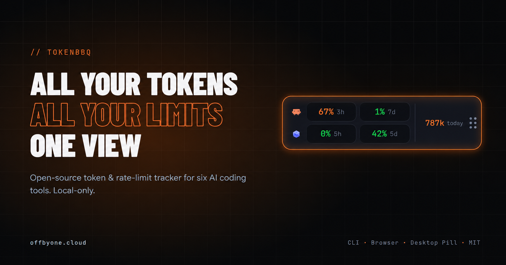
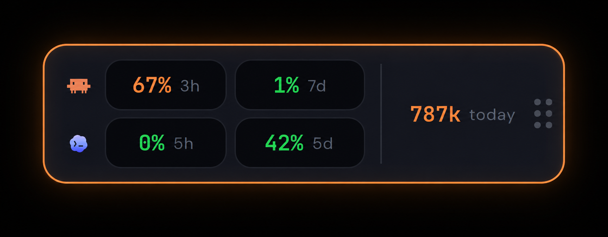

# TokenBBQ

[](https://www.npmjs.com/package/tokenbbq)
[](https://opensource.org/licenses/MIT)

<p align="center">
  <a href="https://offbyone.cloud">Homepage</a> |
  <a href="https://www.npmjs.com/package/tokenbbq">npm</a> |
  <a href="https://github.com/offbyone1/tokenbbq/releases/latest">Desktop releases</a>
</p>

<p align="center">
  <strong>Providers tell you "50% used".<br>TokenBBQ answers: 50% of what?</strong>
</p>

A percentage is not a usage report. TokenBBQ turns the local data your AI coding tools already write into absolute numbers: tokens, estimated cost, model and project breakdowns, daily/monthly trends, and the Claude/Codex rate-limit windows you still have left.

It has two parts that answer two different questions:

- **Dashboard:** What did I use?
- **Desktop Pill:** How much is still left?

<p align="center">
  
</p>

Start the dashboard:

```bash
npx tokenbbq@latest
```

No install. No config. No API key for the dashboard. No TokenBBQ cloud.

## What TokenBBQ Is

TokenBBQ is a local usage dashboard for AI-coding CLIs. It reads the local usage files those tools already write and turns them into one clear view.

It is for anyone working with AI-coding CLIs, whether through a subscription plan or API usage.

It answers the questions the built-in counters only partly answer:

- What did I spend today, this week, or this month?
- How many tokens did I actually burn?
- Which provider and model drove the cost?
- Which projects are driving usage?
- How did usage change over time?
- How much of the Claude/Codex rate-limit window is still left?

## Dashboard: What Did I Use?

The dashboard opens locally in your browser. It is the historical view: totals, trends, models, sources, projects, and day-by-day detail.

<p align="center">
  
</p>

Dashboard highlights:

- estimated cost, total tokens, active days, cost/day, and top model
- daily token usage timeline by source
- cost split by provider
- top models by cost
- monthly trend
- activity heatmap
- project breakdowns
- expandable daily table with per-source detail
- time filters for short-term and long-term usage views
- live refresh while the dashboard is running

Start it with:

```bash
npx tokenbbq@latest
```

By default it opens `localhost:3000`. Use `--port=<n>` if you want a different port.

## Desktop Pill: How Much Is Left?

The desktop pill is a separate native app for Windows and macOS. It stays on top of your screen and gives you the live view: current Claude/Codex subscription windows plus today's local AI coding usage.

<p align="center">
  
</p>

The pill shows:

- Claude 5-hour and 7-day window utilization
- Codex primary and secondary window utilization when available
- reset timing for those windows
- today's local AI-tool token usage
- per-source breakdown when expanded
- one-click access to the full dashboard

The pill is not started with `npx tokenbbq`. It is distributed as a desktop installer and bundles the TokenBBQ sidecar internally, so end users do not need Node.js for the widget.

Download the latest desktop release:

[github.com/offbyone1/tokenbbq/releases/latest](https://github.com/offbyone1/tokenbbq/releases/latest)

| Platform | File |
|---|---|
| Windows | `TokenBBQ_<version>_x64-setup.exe` (NSIS, recommended) or `TokenBBQ_<version>_x64_en-US.msi` |
| macOS (Apple Silicon, M1+) | `TokenBBQ_<version>_aarch64.dmg` |

The macOS build is unsigned, so on first launch Gatekeeper may block it. Right-click the app, choose **Open**, then confirm. Windows SmartScreen may also warn; choose **More info** then **Run anyway**.

## Supported Tools

| Tool | What TokenBBQ reads | What you get |
|---|---|---|
| Claude Code | local usage files | tokens, estimated cost, models, sessions, project context when available |
| Codex | local usage files | tokens, estimated cost, and local rate-limit snapshots when present |
| Gemini | local usage files | tokens, models, and project context when available |
| OpenCode | local usage data | tokens, estimated cost, and project/worktree context |
| Amp | local usage data | tokens, estimated cost, and cache-token details when available |
| Pi-Agent | local usage files | tokens and emitted cost fields |

Default locations are detected automatically. Environment variables can override source paths when your tools are installed somewhere else:

| Tool | Override |
|---|---|
| Claude Code | `CLAUDE_CONFIG_DIR` |
| Codex | `CODEX_HOME` |
| Gemini | `GEMINI_DIR` |
| OpenCode | `OPENCODE_DATA_DIR` |
| Amp | `AMP_DATA_DIR` |
| Pi-Agent | `PI_AGENT_DIR` |

## CLI

```bash
npx tokenbbq                # Open the local dashboard in your browser
npx tokenbbq daily          # Daily usage table in the terminal
npx tokenbbq monthly        # Monthly usage table in the terminal
npx tokenbbq summary        # Compact terminal summary
npx tokenbbq scan           # DashboardData JSON to stdout, then exit
npx tokenbbq --json         # JSON to stdout
npx tokenbbq --port=8080    # Use a custom dashboard port
npx tokenbbq --no-open      # Start the server without opening the browser
npx tokenbbq --help         # Show help
```

`scan` is useful for embedding TokenBBQ in other tools. The desktop pill uses the same idea internally: run a headless scan, read the JSON, then render a small always-on-top view.

## How It Works

TokenBBQ does not proxy model traffic and does not watch your network.

1. It reads the local usage data your AI coding tools already write.
2. It turns that data into absolute token counts and estimated cost.
3. It groups usage by day, month, source, model, and project.
4. It shows the result in a local browser dashboard or terminal table.
5. The desktop pill adds the live "how much is left?" view for Claude/Codex subscription windows.

For Codex, TokenBBQ reads the latest local rate-limit snapshot when Codex has written one. For Claude, the desktop pill can use your local Claude session details to show live subscription-window usage.

## Privacy

TokenBBQ is local-first:

- The dashboard reads local files and serves `localhost`.
- There is no TokenBBQ account.
- There is no TokenBBQ backend.
- Usage data is not uploaded to TokenBBQ.
- Model pricing is fetched from LiteLLM when available.
- The desktop pill may contact Claude.ai to display live Claude subscription-window utilization.
- Widget credentials stay local in the OS credential store.

Your AI coding logs can contain project names and code context. TokenBBQ's job is to make that local data understandable, not to send it somewhere else.

## Development

```bash
npm install
npm run dev
npm test
npm run build
```

Build the desktop widget locally:

```bash
npm install --prefix widget
npm run widget:dev
npm run widget:build
```

`widget:build` requires [Bun](https://bun.sh) on `PATH` because the widget packages the CLI as a standalone sidecar.

## Guides

- [How to Track Claude Code Token Usage](https://offbyone.cloud/blog/track-claude-code-token-usage.html) — absolute token numbers and the 5-hour / 7-day rate-limit windows
- [How to Track OpenAI Codex Token Usage](https://offbyone.cloud/blog/track-openai-codex-token-usage.html) — same setup for Codex, with a Codex-vs-Claude comparison
- [Track AI Token Usage Per Project](https://offbyone.cloud/blog/track-token-usage-per-project.html) — split daily costs across multiple repositories

## Credits

TokenBBQ builds on data-loading patterns from [ccusage](https://github.com/ryoppippi/ccusage) by [@ryoppippi](https://github.com/ryoppippi). ccusage is the recognized predecessor in this space; TokenBBQ extends the idea across more tools, a browser dashboard, project views, and the desktop pill.

## Contributing

See [CONTRIBUTING.md](CONTRIBUTING.md) for development setup and guidelines for adding new tools.

## Support

Buy me a Token:

[](https://ko-fi.com/M4M11VBHXH)

## License

[MIT](LICENSE) (c) [offbyone1](https://github.com/offbyone1)
