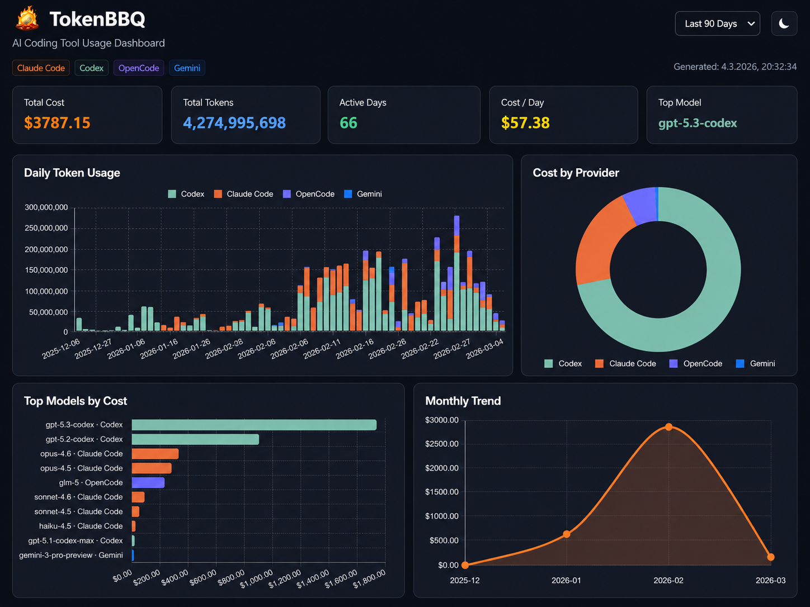

# TokenBBQ

[](https://www.npmjs.com/package/tokenbbq)
[](https://opensource.org/licenses/MIT)

<p align="center">
  <a href="https://offbyone.cloud">Homepage</a> |
  <a href="https://www.npmjs.com/package/tokenbbq">npm</a>
</p>

<p align="center">
  <strong>Providers tell you "50% used".<br>TokenBBQ answers: 50% of what?</strong>
</p>

TokenBBQ is a local dashboard for AI coding tool usage. It reads the local data your tools already write and turns it into absolute numbers: tokens, estimated cost, model and project breakdowns, daily/monthly trends, and local Claude/Codex rate-limit snapshots when those tools expose them.

Run it directly with npx:

```bash
npx tokenbbq@latest
```

No install. No config. No API key. No TokenBBQ cloud.

## Dashboard

TokenBBQ starts a local server and opens the dashboard in your browser. By default it uses `localhost:3000`; pass `--port=<n>` to choose another port.

```bash
npx tokenbbq@latest
npx tokenbbq@latest --port=8080
npx tokenbbq@latest --no-open
```

Dashboard highlights:

- estimated cost, total tokens, active days, cost/day, and top model
- daily token usage timeline by source
- cost split by provider
- top models by cost
- monthly trend
- activity heatmap
- project breakdowns
- expandable daily table with per-source detail
- time filters for short-term and long-term usage views
- live refresh while the dashboard is running

<p align="center">
  
</p>

## Supported Tools

| Tool | What TokenBBQ reads | What you get |
|---|---|---|
| Claude Code | local usage files | tokens, estimated cost, models, sessions, project context when available |
| Codex | local usage files | tokens, estimated cost, and local rate-limit snapshots when present |
| Gemini | local usage files | tokens, models, and project context when available |
| OpenCode | local usage data | tokens, estimated cost, and project/worktree context |
| Amp | local usage data | tokens, estimated cost, and cache-token details when available |
| Pi-Agent | local usage files | tokens and emitted cost fields |

Default locations are detected automatically. Environment variables can override source paths when your tools are installed somewhere else:

| Tool | Override |
|---|---|
| Claude Code | `CLAUDE_CONFIG_DIR` |
| Codex | `CODEX_HOME` |
| Gemini | `GEMINI_DIR` |
| OpenCode | `OPENCODE_DATA_DIR` |
| Amp | `AMP_DATA_DIR` |
| Pi-Agent | `PI_AGENT_DIR` |

## Options

```bash
npx tokenbbq                # Open the local dashboard in your browser
npx tokenbbq --port=8080    # Use a custom dashboard port
npx tokenbbq --no-open      # Start the server without opening the browser
npx tokenbbq --help         # Show help
```

TokenBBQ is dashboard-only. The supported product surface is the local browser dashboard started through `npx tokenbbq`.

## How It Works

TokenBBQ does not proxy model traffic and does not watch your network.

1. It reads the local usage data your AI coding tools already write.
2. It persists normalized events under your local TokenBBQ data directory.
3. It turns those events into absolute token counts and estimated cost.
4. It groups usage by day, month, source, model, and project.
5. It serves the result through a local browser dashboard.

For Codex, TokenBBQ reads the latest local rate-limit snapshot when Codex has written one.

## Privacy

TokenBBQ is local-first:

- The dashboard reads local files and serves `localhost`.
- There is no TokenBBQ account.
- There is no TokenBBQ backend.
- Usage data is not uploaded to TokenBBQ.
- Model pricing is fetched from LiteLLM when available.

Your AI coding logs can contain project names and code context. TokenBBQ's job is to make that local data understandable, not to send it somewhere else.

## Development

```bash
npm install
npm run dev
npm run test
npm run build
```

`npm run dev` starts the dashboard via `tsx`. `npm run build` produces the publishable `dist/index.js` package entry used by `npx tokenbbq`.

## Guides

- [How to Track Claude Code Token Usage](https://offbyone.cloud/blog/track-claude-code-token-usage.html)
- [How to Track OpenAI Codex Token Usage](https://offbyone.cloud/blog/track-openai-codex-token-usage.html)
- [Track AI Token Usage Per Project](https://offbyone.cloud/blog/track-token-usage-per-project.html)

## Credits

TokenBBQ builds on data-loading patterns from [ccusage](https://github.com/ryoppippi/ccusage) by [@ryoppippi](https://github.com/ryoppippi). ccusage is the recognized predecessor in this space; TokenBBQ extends the idea across more tools, a browser dashboard, project views, and rate-limit snapshots where available.

## Contributing

See [CONTRIBUTING.md](CONTRIBUTING.md) for development setup and guidelines for adding new tools.

## Support

Buy me a Token:

[](https://ko-fi.com/M4M11VBHXH)

## License

[MIT](LICENSE) (c) [offbyone1](https://github.com/offbyone1)
